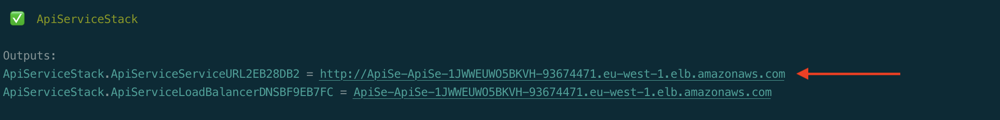
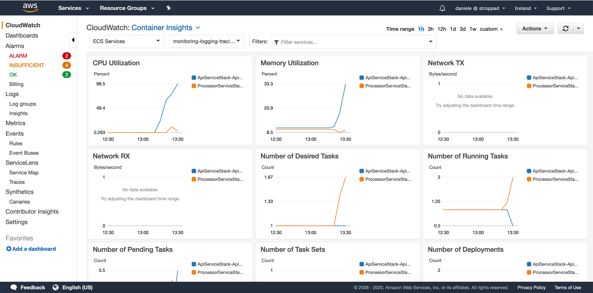
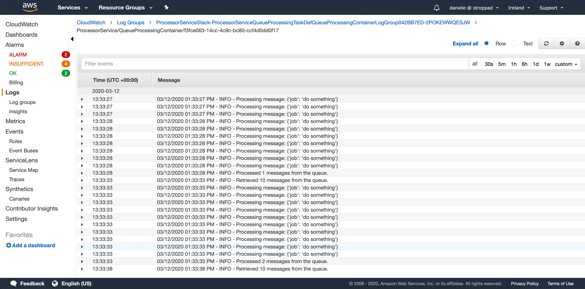
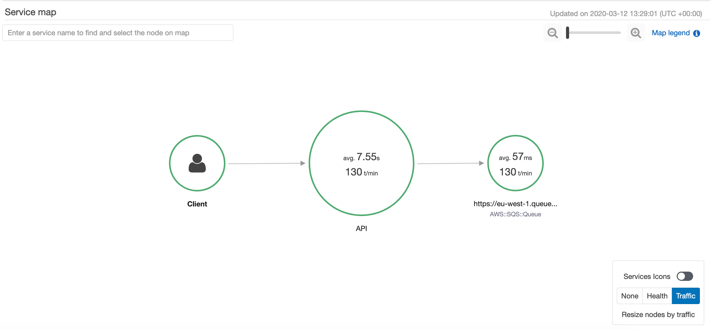

# Monitoring, Logging, and Observability - Demo

This demo shows how to add monitoring, logging, and observability to your containerized applications. In this demo you'll set up:
 * An ECS cluster with Container Insights enabled
 * An ECS service receiving requests via a public Application Load Balancer
 * A SQS queue
 * An ECS service consuming messges from the SQS queue
 * X-Ray tracing and Cloudwatch Logs for the ECS services

## Setup
To setup the demo in your environment follow these steps:

* Clone this repository to your local environment
    ```bash
    git clone https://github.com/dstroppa/ecs-monitoring-logging-tracing-demo
    ```
* If you haven't done it already, install the [AWS CDK](https://aws.amazon.com/cdk/)
    ```bash
    npm install -g aws-cdk
    ```
* From within the cdk folder, install the required npm packages
    ```bash
    cd ecs-monitoring-logging-tracing-demo/cdk
    npm install
    ```
* Deploy the demo
    ```bash
    cdk deploy '*'
    ```

## Usage

* Copy the `ApiServiceStack.ApiServiceServiceURL` value from the output of the `cdk deploy` command

    
* Start sending POST request to `/job`, e.g.

    `curl -X POST http://apise-apise-1jwweuwo5bkvh-93674471.eu-west-1.elb.amazonaws.com/job -d '{"job":"do something"}' -H "Content-Type: application/json"`

    > **Note**: you can use the [Distributed Load Testing](https://aws.amazon.com/solutions/distributed-load-testing-on-aws/) solution to generate your requests.
* Once you've generated enough requests, you can explore the Container Insights dashboard, the CloudWatch Logs streams, and the X-Ray service map and traces.

    

    
    
    

## Cleanup
Once completed, make sure to delete the resource created with `cdk destroy '*'`.